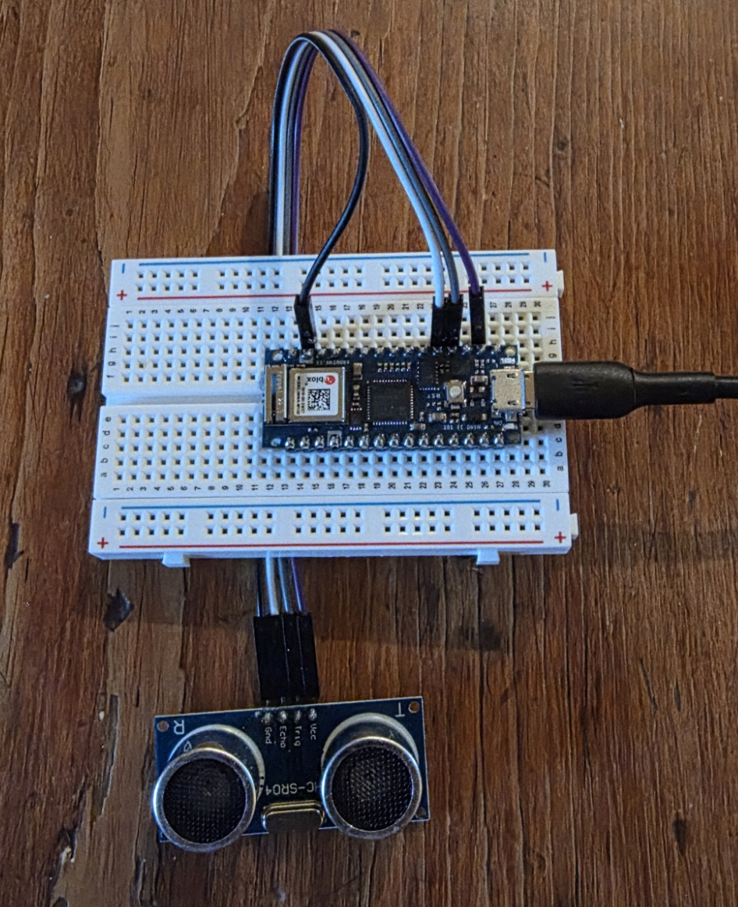
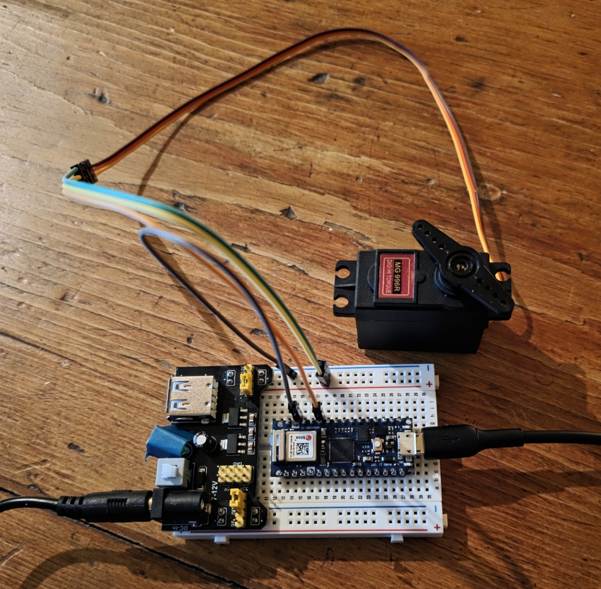
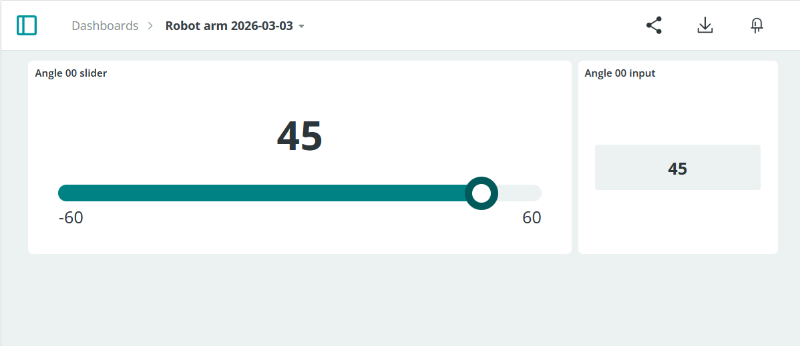

<table>
<tr><th>File</th><th>Description</th></tr>
<tr>
<td valign="top">

<a href="ultrasonic_2026_03_02_04_ints.ino">ultrasonic_2026_03_02_04_ints.ino</a>

</td>
<td valign="top">

Prints distance measured by ultrasonic sensor in millimeters.  Uses Arduino <a href="https://docs.arduino.cc/language-reference/en/functions/interrupts/noInterrupts">noInterrupts()</a> to keep timing more accurate.  Using <a href="https://en.wikipedia.org/wiki/Exponential_smoothing">exponential smoothing</a> on the measurements.

<ul>
<li>Link: <a href="https://www.handsontec.com/dataspecs/HC-SR04-Ultrasonic.pdf">HC-SR04 Ultrasonic Sensor Module</a></li>
<li>Alternative, array-based smoothing implementation: <a href="ultrasonic_2026_03_02_03_exp-mov-ave.ino">ultrasonic_2026_03_02_03_exp-mov-ave.ino</a></li>
</ul>
</td>
</tr>
<tr>
<td valign="top">

<a href="servo-dashboard_2026-03-03.ino">servo-dashboard_2026-03-03.ino</a>

</td>
<td valign="top">

Turns a servo motor in response to interraction with a dashboard

<ul>
<li>Link: <a href="https://www.handsontec.com/dataspecs/HC-SR04-Ultrasonic.pdf">MG996R Metal Gear Servo Motor</a></li>
</ul>

</td>
</tr>
</table>

